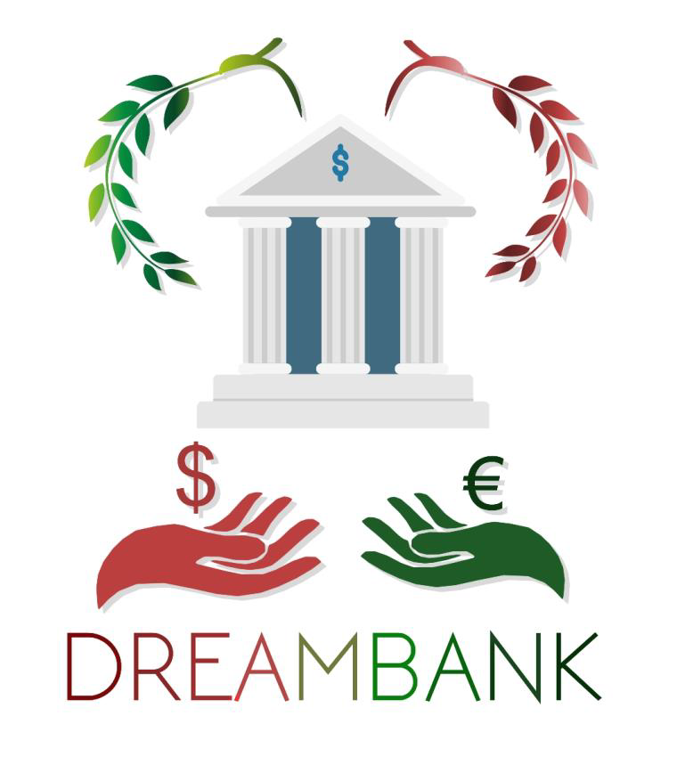

Bienvenue sur DreamBank  
========================

DreamBank en tant qu'application GED permettent de traiter de plus en plus de documents, envoyés par de plus en plus de clients. Ensuite, elles permettent de conserver plus longtemps les informations telles que les relevés et les avis, en les conservant sur un support durable. Enfin, elles permettent d’échapper au coût de l’encre et du papier, ainsi qu’à ceux des transports et des NPAI (N’habite pas à l’adresse indiquée).

Lien vers le projet 
-------------------
https://github.com/oussama-guedda/DreamBank

Languages utilisés
-------------------
 * framework Symfony
 * php, Mysql
 * html5, css3, Bootstrap 
 * javascript

Requirements
-------------------
    PHP 7.1.3 or higher;
    WampServer for ;
    and the usual Symfony application requirements.

Installation
-------------------

Download Symfony to install the symfony binary on your computer and run this command:

  $ symfony new --demo my_project

Alternatively, you can use Composer:

  $ composer create-project symfony/symfony-demo my_project

Usage
-------------------

There's no need to configure anything to run the application. If you have installed Symfony, run this command and access the application in your browser at the given URL (https://localhost:8000 by default):

  $ cd my_project/
  $ symfony serve

If you don't have the Symfony binary installed, run php -S localhost:8000 -t public/ to use the built-in PHP web server or configure a web server like Nginx or Apache to run the application.
Tests

Execute this command to run **tests**:

  $ cd my_project/
  $ ./bin/phpunit
  
Structure du projet
-------------------

configuration de parameters.yml
-----------------------------
parameters:
   * database_host: 127.0.0.1
   * database_port: null
   * database_name: dreamBank
   * database_user: root
   * database_password: null
   * mailer_transport: smtp
   * mailer_host: 127.0.0.1
   * mailer_user: null
   * mailer_password: null
   * secret: sqkldnqlkfcqklksqkffnkqsf
   
 Accessibilité 
 ------------------
 Les documents que nous traiterons seront au format odt ou pdf, un format libre, permettant d’assurer au maximum interopérabilité.
 
 Pour finir, le site sera en Web Responsive et sera donc accessible sur PC et smartphone et e tant destine a une banque, il sera multilingue afin de permettre aux clients de toute origine d’y naviguer convenablement. Enfin, le site sera conforme aux standards W3C et les aura valide .
 
 Outils utilisés
 --------------------
 
 - GanttProject, pour obtenir le diagramme de Gantt (Disponible sur : www.ganttproject.biz )
 - Gimp, pour le design du logo (Disponible sur : www.gimp.org )
 - WampServer, pour tester la base de données (Disponible sur : www.wampserver.com )
 - PHPStorm, éditeur de code PHP (Disponible sur : www.jetbrains.com )
 - Entreprise Architect, pour dessiner les diagrammes UML (Disponible sur : sparxsystems.com) (version d’essai)
 - Postman, pour tester les requêtes SQL (Disponible sur : www.getpostman.com )